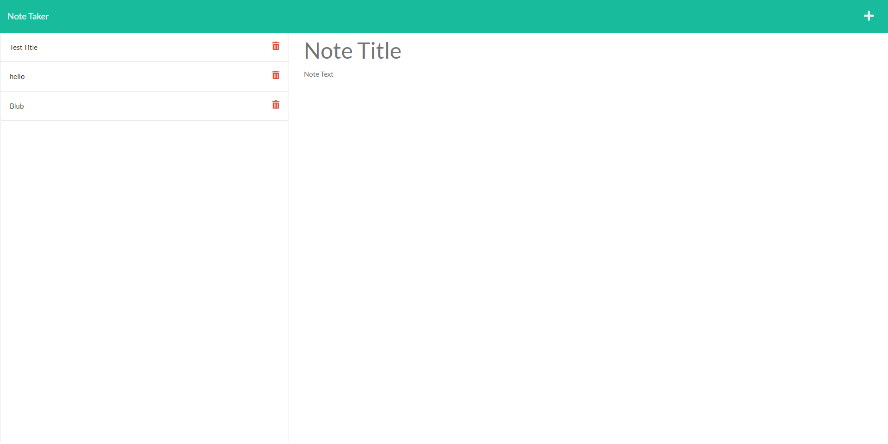
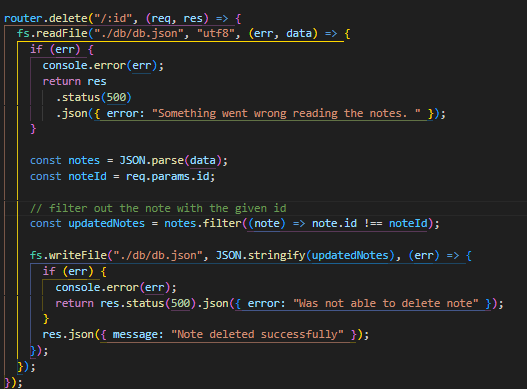

# Note Taker

## Technology Used

| Technology Used |                                                    Resource URL                                                    |
| --------------- | :----------------------------------------------------------------------------------------------------------------: |
| JavaScript      | [https://developer.mozilla.org/en-US/docs/Web/JavaScript](https://developer.mozilla.org/en-US/docs/Web/JavaScript) |
| Nodejs          |                                   [https://nodejs.org/en](https://nodejs.org/en)                                   |

## Description

A webpage that is equipped with the ability to take notes and save them on a server side database. You could look at old notes and create new ones. Also you can delete them by pressing the the delete button next to the note.

## Usage

Click the "Get Started" button to be led to the notes page. Then Type whatever you like in the note title and note text both must be present in order to save the note. At the top right there is a save button that puts the note on the left column. You may press any note on the left to see the full note. The trashcan icon can be used to discard any notes you don't want.

## Learning Points

1. Gained a fundmental idea on how to use express.
2. New understanding on how to connect front-end to back-end

# Features

I was able to implement the bonus delete feature by using the filter method and added a message to say it was successfull.

## Author Info

- [GitHub](https://github.com/Jarell-Chinn)
